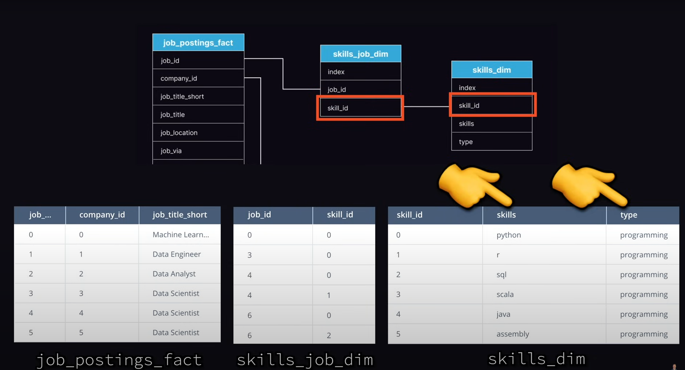
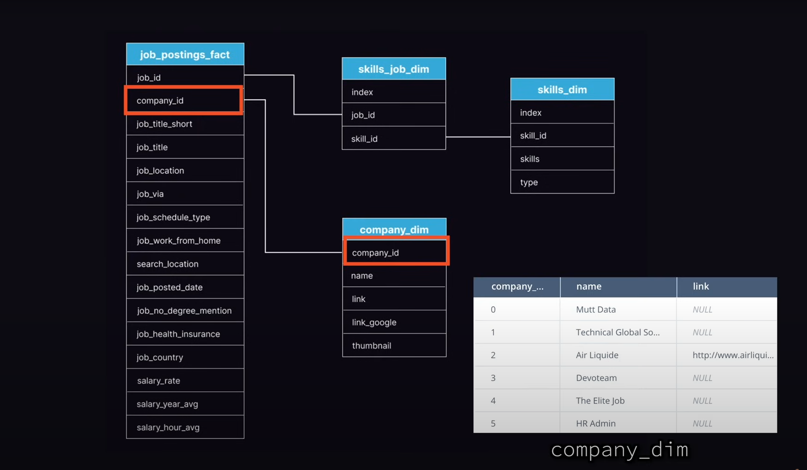

# Dataset and Problem Statement for the Course
We are going to take the perspective of a job seeker who is looking to get into the field of data science. We will be using a dataset(Datascience job postings 2023) that contains information about job postings for data science positions. The dataset contains information such as the job title, company name, location, job description, and salary range. The goal is to identify that what are some of the highest paying jobs along with what are the most optimal skills to learn.

This type of data is collected in <a href="https://datanerd.tech/">This website</a>
This aggregates job postings from various sources and provides a dataset that can be used for analysis. It includes pay requirement for the different jobs along with the skills required for the job. Along with the skill versus pay, we will also be looking at the location of the job and how that affects the pay.

# ERD for the Dataset(Entity Relationship Diagram)

We have 4 major tables:
1. `job_posting_fact`: This fact table contains all of the job postings
2. `skills_job_dim & skills_dim`: Two dimension tables that contain information about the skills required for those jobs.
3. `company_dim`: This dimension table contains information about the company that posted the job.

## Fact Tables
- Contains the core data for the business analysis
- Measure and record business events(e.g job postings)

Because of this there is usually a high volume of record. There is also usually some form of foreign key relationship to the dimension tables.

## Dimension Tables
- Contains the descriptive information related to the fact data(e.g company name, job title, skills)
- Support filtering, grouping and labeling of facts in reports.

A fact is a piece of information with a specific numerical value, like a sale or a download. Facts are kept in fact tables, which are linked to several dimension tables by a foreign key. Facts are accompanied by dimensions, which describe the items in a fact table. 
Fact tables have more records and fewer attributes, while dimension tables have more attributes and fewer records. While the dimension table expands horizontally, the fact table expands vertically. While the dimension table has a primary key, the table has a concatenated key.
A single-dimension membership can be connected to many facts in the majority of dimensions, where each fact links to one and only one member of the dimension. This is known as each relationship in relational database jargon. However, connecting a single piece of evidence to several dimension members is frequently helpful. 
A fact table contains the primary keys of a referenced dimension table, and the dimension table contains the descriptive information.

In our case the dimensions tables are skills_dim and company_dim.

# Database 
We are mainly going to be using Postgres and SQlite for this.