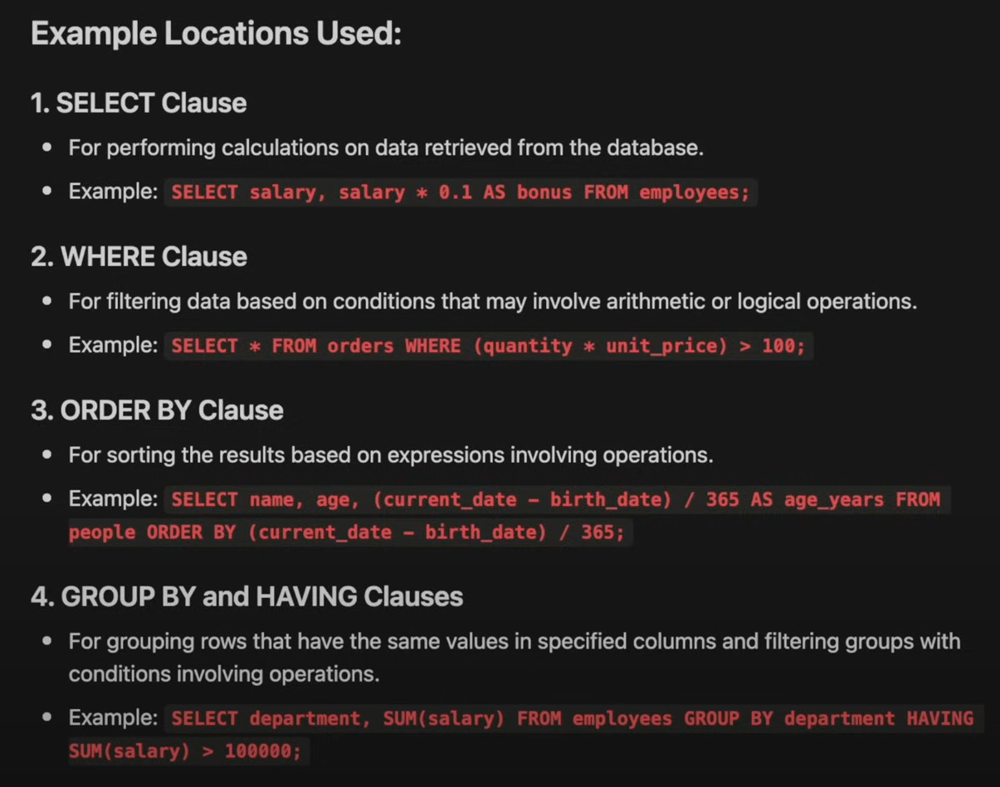

# Operations
**Arithmetic Operations**: These operations are used to perform mathematical calculations.

- `+` : Addition
- `-` : Subtraction
- `*` : Multiplication
- `/` : Division
- `%` : Modulus(returns the remainder of the division)

```sql
SELECT 
	project_company,
    nerd_id,
    nerd_role,
    hours_rate AS rate_original,
    hours_rate - 5 AS rate_drop,
    hours_rate + 5 AS rate_hike
FROM
	invoices_fact
```

In the above query, we are performing arithmetic operations on the `hours_rate` column. We are subtracting 5 from the `hours_rate` column and storing it in a new column `rate_drop`. We are adding 5 to the `hours_rate` column and storing it in a new column `rate_hike`. This is useful when we want to calculate the difference between two columns or when we want to add a fixed value to a column and see what it gives back.



# % 
- `MOD` - returns the remainder of the division

```sql
SELECT 
    project_company,
    nerd_id,
    nerd_role,
    hours_rate AS rate_original,
    hours_spent % 8 AS extra_hours
FROM
    invoices_fact
WHERE 
    invoices
```

In the above query, we are performing the modulus operation on the `hours_rate` column. We are dividing the `hours_rate` column by 5 and storing the remainder in a new column `rate_remainder`. This is useful when we want to see the remainder of the division of a column by a number.