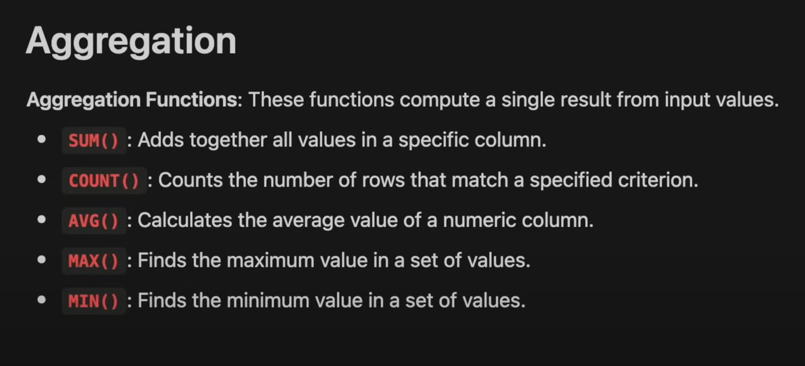

# SUM
- `SUM` - returns the sum of all the values in a column

```sql
SELECT 
	SUM(salary_year_avg) as salary_sum
FROM 
	invoices_fact
```

In the above query, we are calculating the sum of the `salary_year_avg` column and storing it in a new column `salary_sum`. This is useful when we want to calculate the sum of all the values in a column. `SUM` can also be used together with `DISTINCT` to calculate the sum of distinct values in a column.

# COUNT
- `COUNT` - returns the number of rows in a table
- `COUNT(DISTINCT column_name)` - returns the number of distinct values in a column

```sql
SELECT 
    COUNT(DISTINCT job_title_short) AS job_type_total
FROM 
	job_postings_fact
```

In the above query, we are calculating the number of distinct values in the `job_title_short` column and storing it in a new column `job_type_total`. This is useful when we want to calculate the number of distinct values in a column.

# AVG
- `AVG` - returns the average of all the values in a column

```sql
SELECT 
    AVG(salary_year_avg) as salary_avg
FROM
    job_postings_fact
```

```sql
SELECT 
    AVG(salary_year_avg) as salary_avg,
    MIN(salary_year_avg) as salary_min,
    MAX(salary_year_avg) as salary_max
FROM
    job_postings_fact
WHERE job_title_short = 'Data Analyst'
```

In the above query, we are calculating the average of the `salary_year_avg` column and storing it in a new column `salary_avg`. This is useful when we want to calculate the average of all the values in a column. `AVG` can also be used together with `MIN` and `MAX` to calculate the average, minimum, and maximum values in a column.

# GROUP BY
- `GROUP BY` - groups the result set by one or more columns
- E.g `GROUP BY column_name` will group the result set by the values in the `column_name` column
- Note: if you have an aggregate function, you need to include every column that's not aggregated in the `GROUP BY` clause

- The GROUP BY clause groups the rows that have the same values in the specified column(s)
- GROUP BY: Used to group rows based on column values and perform aggregate operations on each group.

Grouping Rows: The GROUP BY clause identifies unique values in the specified column(s) and groups all rows that share the same value(s) into a single group.

Applying Aggregate Functions: Once the rows are grouped, SQL applies the aggregate functions (like SUM, COUNT, AVG, MAX, MIN, etc.) to each group. These functions perform calculations on the columns specified in the SELECT statement for each group of rows.

Returning Results: The result of the query is a new set of rows where each row represents a group and contains the aggregated data.

# HAVING
- `HAVING` - filters the result set based on an aggregate function and groups.
- Used because you can't use the `WHERE` clause with aggregate functions.

```sql
SELECT 
	job_title_short as jobs,
    COUNT(job_title_short) as job_count,
    AVG(salary_year_avg) as salary_avg,
    MIN(salary_year_avg) as salary_min,
    MAX(salary_year_avg) as salary_max
FROM
    job_postings_fact
GROUP BY 
	job_title_short
HAVING
	COUNT(job_title_short) > 100
ORDER BY 
	salary_avg DESC
```

In the above query, we are calculating the average, minimum, and maximum values of the `salary_year_avg` column for each distinct value in the `job_title_short` column. We are also calculating the number of occurrences of each distinct value in the `job_title_short` column. We are filtering the result set to only include rows where the number of occurrences of each distinct value in the `job_title_short` column is greater than 100. This is useful when we want to filter the result set based on an aggregate function and groups.