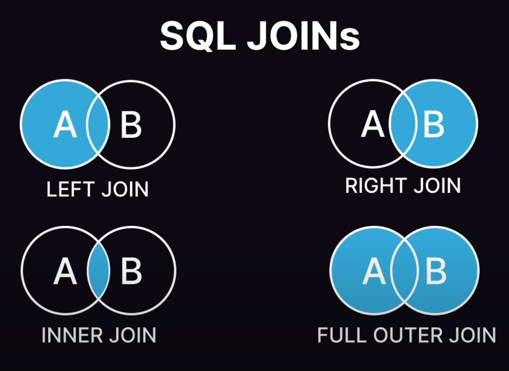
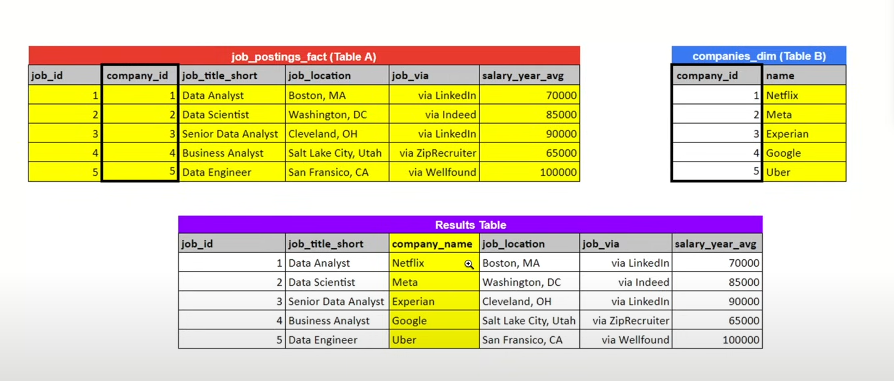
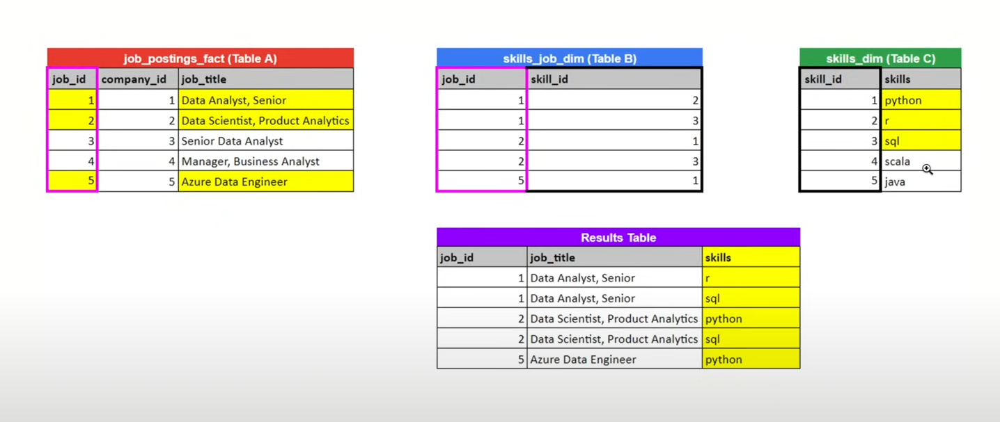

# JOINS


# LEFT JOIN
Essentially a LEFT JOIN is a JOIN that returns all the rows from the left table, and the matched rows from the right table. If there is no match, the result is NULL from the right side. This means that a LEFT JOIN returns all the values from the left table, plus matched values from the right table or NULL in case of no matching join predicate. 

- A and B are two seperate tables, when we use this joint it will return all of the contents of A and the matched contents of B. If there is no match in B, it will return NULL.

```sql
SELECT
    job_postings.job_id,
    job_postings.job_title_short,
    job_postings.company_id,
    companies.name
FROM
    job_postings_fact AS job_postings
    LEFT JOIN company_dim AS companies ON job_postings.company_id = companies.company_id
```

In this example, we are selecting the job_id, job_title_short, company_id, and name from the job_postings_fact table and the company_dim table. We are joining the two tables on the company_id column. This will return all the rows from the job_postings_fact table and the matched rows from the company_dim table. If there is no match, the result will be NULL from the company_dim table.



# RIGHT JOIN
Essentially a RIGHT JOIN is a JOIN that returns all the rows from the right table, and the matched rows from the left table. If there is no match, the result is NULL from the left side. This means that a RIGHT JOIN returns all the values from the right table, plus matched values from the left table or NULL in case of no matching join predicate.


- A and B are two seperate tables, when we use this joint it will return all of the contents of B and the matched contents of A. If there is no match in A, it will return NULL.

# INNER JOIN

An INNER JOIN is a JOIN that returns only the rows that have matching values in both tables. If there is no match, the result is an empty set. This means that an INNER JOIN returns only the values that exist in both tables.

- A and B are two seperate tables, when we use this joint it will return only the matched contents of A and B. If there is no match in A or B, it will return NULL.



```sql
SELECT 
	job_postings.job_id,
    job_postings.job_title_short,
    skills_to_job.skill_id,
    skills.skills
FROM job_postings_fact AS job_postings
INNER JOIN skills_job_dim AS skills_to_job ON job_postings.job_id = skills_to_job.job_id
INNER JOIN skills_dim AS skills ON skills_to_job.skill_id = skills.skill_id
```

In this example, we are selecting the job_id, job_title_short, skill_id, and skills from the job_postings_fact table, skills_job_dim table, and skills_dim table. We are joining the job_postings_fact table with the skills_job_dim table on the job_id column and the skills_job_dim table with the skills_dim table on the skill_id column. This will return only the rows that have matching values in all three tables. In other words the first join will will iterate all job postings that have a skill, and the second join will iterate all skills that are required for a job posting.

# FULL OUTER JOIN

A FULL OUTER JOIN is a JOIN that returns all the rows from both tables. If there is no match, the result is NULL from the table that lacks the match. This means that a FULL OUTER JOIN returns all the values from both tables.

- A and B are two seperate tables, when we use this joint it will return all of the contents of A and B. If there is no match in A or B, it will return NULL.

```sql
SELECT 
    job_postings.job_id,
    job_postings.job_title_short,
    skills_to_job.skill_id,
    skills.skills
FROM job_postings_fact AS job_postings
FULL OUTER JOIN skills_job_dim AS skills_to_job ON job_postings.job_id = skills_to_job.job_id
FULL OUTER JOIN skills_dim AS skills ON skills_to_job.skill_id = skills.skill_id
```

In this example, we are selecting the job_id, job_title_short, skill_id, and skills from the job_postings_fact table, skills_job_dim table, and skills_dim table. We are joining the job_postings_fact table with the skills_job_dim table on the job_id column and the skills_job_dim table with the skills_dim table on the skill_id column. This will return all the rows from both tables. If there is no match, the result will be NULL from the table that lacks the match.
