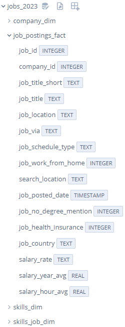
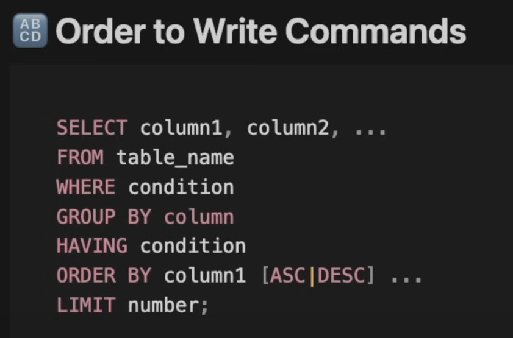

# SELECT * / FROM
- `SELECT` - identifies the columns or data from a database
- `*` - selects all columns(special command)
- `FROM` - identifies the table from which the data is to be selected



As you can see in the image above, we have the tables `job_posting_fact`, `skills_job_dim`, `skills_dim`, and `company_dim`. These are the tables that you can select data from. Columns in these tables are the attributes that you can select. See the example below:

```sql
SELECT skill_id
FROM skills_dim
```
In the above example, we are selecting the `skill_id` column from the `skills_dim` table. This will return all the `skill_id` values from the `skills_dim` table.

You can also select multiple columns from a table seperated by a comma. See the example below:

```sql
SELECT job_title_short, job_location
FROM job_postings_fact
```

In the above example, we are selecting the `job_title_short` and `job_location` columns from the `job_postings_fact` table. This will return all the `job_title_short` and `job_location` values from the `job_postings_fact` table.

The conventions is:

```sql
SELECT 
	job_title_short, 
    job_location
FROM 
	job_postings_fact
```

As you can see we have put the columns in a seperate line for better readability. This is not necessary but it is a good practice to follow.

You can specify the columns by putting the table name before the column name. This is useful when you are selecting columns from multiple tables where you must specify the table name beforehand. See the example below:

```sql
SELECT 
	job_postings_fact.job_title_short, 
    job_postings_fact.job_location
FROM 
	job_postings_fact
```

# LIMIT
- `LIMIT` - limits the number of rows returned by a query
- `LIMIT 10` - limits the number of rows returned to 10

In real-world scenarios, you may have a large dataset and you may not want to see all the rows. In such cases, you can use the `LIMIT` clause to limit the number of rows returned by a query. See the example below:

```sql
SELECT 
	job_title_short, 
    job_location
FROM 
	job_postings_fact
LIMIT 5    
```

In the above example, we are selecting the `job_title_short` and `job_location` columns from the `job_postings_fact` table. We are limiting the number of rows returned to 5. This will return the first 5 rows from the `job_postings_fact` table. You always put the `LIMIT` clause at the end of the query.

# DISTINCT
- `DISTINCT` - returns unique values from a column
This is going to follow the `SELECT` statement. It is used to remove duplicate values from a column. See the example below:

- This usually isn't used for the entire query as it takes up a lot of memory. It is used within certain SQL functions

```sql
SELECT DISTINCT
	job_title_short
FROM 
	job_postings_fact
```

In the above example, we are selecting the `job_title_short` column from the `job_postings_fact` table. We are returning only the unique values from the `job_title_short` column. This will return all the unique values from the `job_title_short` column, removing any duplicate values.

You can combine queries in the following way:

```sql
SELECT DISTINCT
	job_title_short
FROM 
	job_postings_fact;
    
SELECT DISTINCT 
	salary_year_avg
FROM 
	job_postings_fact;
```

In the above example, we are having two queries. The first query is selecting the `job_title_short` column from the `job_postings_fact` table and returning only the unique values from the `job_title_short` column. The second query is selecting the `salary_year_avg` column from the `job_postings_fact` table and returning only the unique values from the `salary_year_avg` column. As you can see they are seperated by a semicolon. This is how you can combine multiple queries.

# WHERE
- `WHERE` - filters the rows returned by a query, sets a condition for the query. 
- The `WHERE` clause is directly after the `FROM` clause.

The `WHERE` clause is used to filter the rows returned by a query. You can set a condition for the query using the `WHERE` clause. See the example below:

```sql
SELECT 
	job_title_short,
    job_location,
    job_via,
    salary_year_avg
FROM 
	job_postings_fact
WHERE
	job_title_short = 'Data Analyst'
```

In the above example, we are selecting the `job_title_short`, `job_location`, `job_via`, and `salary_year_avg` columns from the `job_postings_fact` table. We are setting a condition using the `WHERE` clause. The condition is that the `job_title_short` column should be equal to 'Data Analyst'. This will return all the rows where the `job_title_short` column is equal to 'Data Analyst'.

Another example:

```sql
SELECT 
	job_title_short,
    job_location,
    job_via,
    salary_year_avg
FROM 
	job_postings_fact
WHERE
	salary_year_avg > 100000
```

We can also combine multiple conditions using the `AND` and `OR` operators. See the example below:

```sql
SELECT 
    job_title_short,
    job_location,
    job_via,
    salary_year_avg
FROM
    job_postings_fact
WHERE
    salary_year_avg > 100000
    AND job_location = 'New York'
```

In the above example, we are selecting the `job_title_short`, `job_location`, `job_via`, and `salary_year_avg` columns from the `job_postings_fact` table. We are setting two conditions using the `WHERE` clause. The first condition is that the `salary_year_avg` column should be greater than 100000. The second condition is that the `job_location` column should be equal to 'New York'. This will return all the rows where the `salary_year_avg` column is greater than 100000 and the `job_location` column is equal to 'New York'.

If we would have used the `OR` operator instead of the `AND` operator, then the query would have returned all the rows where the `salary_year_avg` column is greater than 100000 or the `job_location` column is equal to 'New York'.

# Comments
- `--` - single line comment

You can add comments to your SQL queries. Comments are ignored by the SQL engine and are used to document your queries. See the example below:

```sql
-- query to see relevant data for Data Analysts
SELECT 
    job_title_short,
    job_location,
    job_via,
    salary_year_avg
FROM
    job_postings_fact
WHERE
    salary_year_avg > 100000
    OR job_location = 'New York' -- I love New York
```

# Multi-line comments
- `/* */` - multi-line comment

You can also add multi-line comments to your SQL queries. Multi-line comments are ignored by the SQL engine and are used to document your queries. See the example below:

```sql
/*
query to see relevant data for Data Analysts
This query will return all the rows where the salary_year_avg column is greater than 100000 or the job_location column is equal to 'New York'
*/
SELECT 
    job_title_short,
    job_location,
    job_via,
    salary_year_avg
FROM
    job_postings_fact
WHERE
    salary_year_avg > 100000
    OR job_location = 'New York' -- I love New York
```

# ORDER BY
- `ORDER BY` - sorts the rows returned by a query
- `ASC` - sorts the rows in ascending order
- `DESC` - sorts the rows in descending order

The `ORDER BY` clause is used to sort the rows returned by a query. You can sort the rows in ascending or descending order using the `ASC` and `DESC` keywords. It comes after the `WHERE` clause. See the example below:

```sql
-- query to see relevant data for Data Analysts
SELECT 
    job_title_short,
    job_location,
    job_via,
    salary_year_avg
FROM
    job_postings_fact
WHERE
    job_title_short = 'Data Analyst'
ORDER BY
	salary_year_avg DESC
```

In the above example, we are selecting the `job_title_short`, `job_location`, `job_via`, and `salary_year_avg` columns from the `job_postings_fact` table. We are setting a condition using the `WHERE` clause. The condition is that the `job_title_short` column should be equal to 'Data Analyst'. We are sorting the rows in descending order based on the `salary_year_avg` column. This will return all the rows where the `job_title_short` column is equal to 'Data Analyst' and the rows will be sorted in descending order based on the `salary_year_avg` column.

# ORDER of SQL Commands

