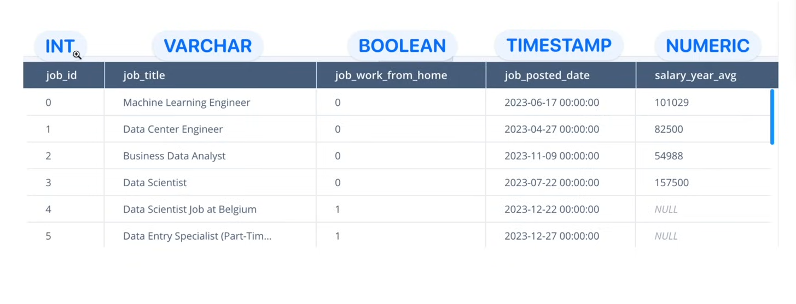

# Data Types

- Data types specify the expected format of a value
- They need to be specified when creating a table for data integrity to ensure that the data stored in the table is consistent. 
- https://www.postgresql.org/docs/current/datatype.html

The common ones are:
- INT: A normal-sized integer that can be signed or unsigned.
- NUMERIC: An exact numeric value with a specified precision and scale. E.g., 12.34 has a precision of 4 and a scale of 2 therefore it can be represented as NUMERIC(4,2).
- TEXT: A variable-length string with no limit in length. Often used for storing text that is longer than VARCHAR.
- VARCHAR: A variable-length string with a limit in length. E.g., VARCHAR(255) can store up to 255 characters.
- BOOLEAN: A truth value that can be either true, false, or null.

