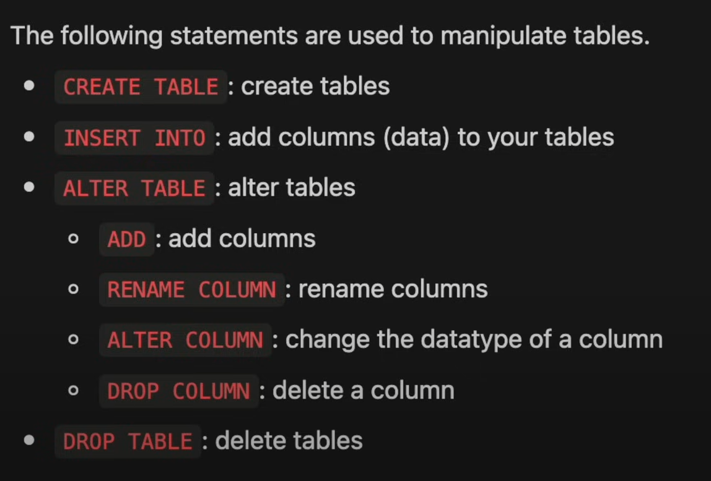
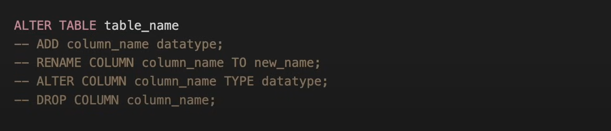
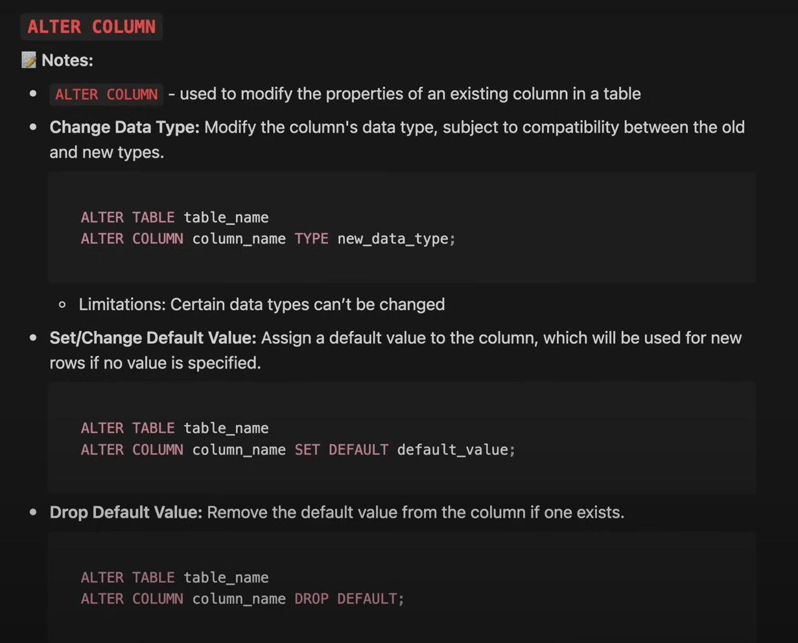

# Manipulate Tables


# CREATE TABLE
- The CREATE TABLE statement is used to create a new table in a database.
- Syntax:
```sql
CREATE TABLE table_name (
    column1_name data_type constraints,
    column2_name data_type constraints,
    ...
);
```

# INSERT INTO
- The INSERT INTO statement is used to insert new records into a table.
- VALUES keyword is used to specify the values to be inserted.

- Syntax:
```sql
INSERT INTO table_name (column1_name, column2_name, ...)
VALUES (value1, value2, ...);
```

# ALTER TABLE
- The ALTER TABLE statement is used to add, delete, or modify columns in an existing table.
- Similar to using `FROM` to specify a table for querying


- Syntax:
```sql
ALTER TABLE table_name
ADD column_name data_type constraints;
```

# UPDATE
- The `UPDATE` statement is used to modify the existing records in a table.
- `SET` keyword is used to specify the columns to be updated.
- `WHERE` keyword is used to specify the condition to filter from the rows to be updated.

- Syntax:
```sql
UPDATE table_name
SET column1_name = value1, column2_name = value2, ...
WHERE condition;
```

# RENAME COLUMN
- The `RENAME COLUMN` statement is used to rename a column in a table.
- We need the old column name and the new column name.

# ALTER COLUMN


# DROP COLUMN
- The `DROP COLUMN` statement is used to delete a column in a table.

- Syntax:
```sql
ALTER TABLE table_name
DROP COLUMN column_name;
```

# DROP TABLE
- The `DROP TABLE` statement is used to delete a table in a database.
- Be careful when using this statement because it will delete the table and all its data.