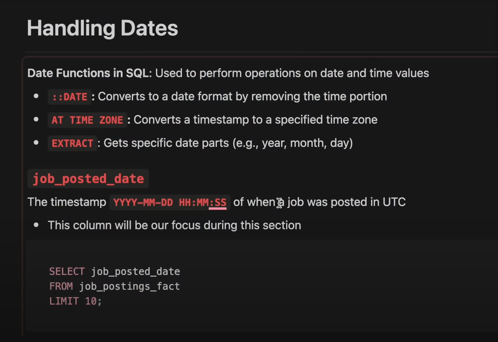

# Handling Dates


# ::DATE

- `::DATE` - converts a string to a date
- `::` - type cast operator used to convert a value to a specific data type.

- In this case, it is converting a timestamp to a date format
- The date format is `YYYY-MM-DD`
- Timestamps are in the format `YYYY-MM-DD HH:MM:SS`

```sql
SELECT 
    timestamp_column::DATE AS date_column;
FROM 
    table_name;
```

Example for this:
    
```sql
    SELECT
    job_title_short as title,
    job_location AS location,
    job_posted_date :: DATE AS date
FROM
    job_postings_fact
LIMIT 5;
```

In the above example, we are selecting the `job_title_short`, `job_location`, and `job_posted_date` columns from the `job_postings_fact` table. We are converting the `job_posted_date` column to a date format using the `::DATE` operator. This will return the `job_title_short`, `job_location`, and `job_posted_date` values from the `job_postings_fact` table in a date format getting rid of the timestamp.

# AT TIME ZONE

- `AT TIME ZONE` - converts a timestamp to a specific timezone.
- `AT TIME ZONE 'UTC'` - converts a timestamp to UTC timezone.
- It can be used on timestamps with or without time zone information
- Recall:
    - TIMESTAMP
        - A specific date and time withou timezone information (YYYY-MM-DD HH:MM:SS)
        - Example: 2021-01-01 12:00:00
    - TIMESTAMP WITH TIME ZONE
        - A specific date and time with timezone information (YYYY-MM-DD HH:MM:SS+TZ)
        - Example: 2021-01-01 12:00:00+00

- Timestamps with Time Zone:
    - Stored as UTC, displayed per query's or system's timezone
    - `AT TIME ZONE` can be used to convert to a specific timezone correctly

```sql
SELECT 
    timestamp_column AT TIME ZONE 'EST';
FROM
    table_name;
```

- Timestamps without Time Zone:
    - Treated as local time in PostgreSQL
    - Using `AT TIME ZONE` assumes the machine's timezone for conversion; specify it, or the default is UTC

```sql
SELECT 
    timestamp_column AT TIME ZONE 'UTC' AT TIME ZONE 'EST';
FROM
    table_name;
```

```sql
SELECT
    job_title_short AS title,
    job_location AS location,
    (job_posted_date AT TIME ZONE 'UTC') AT TIME ZONE 'EST' AS date_time
FROM
    job_postings_fact
LIMIT
    10;
```

# EXTRACT
- `EXTRACT` gets field(e.g year, month, day) from a date/time value
- `EXTRACT(YEAR FROM date_column)` - gets the year from a date column

```sql
SELECT 
    EXTRACT(YEAR FROM date_column) AS year;
FROM
    table_name;
```
